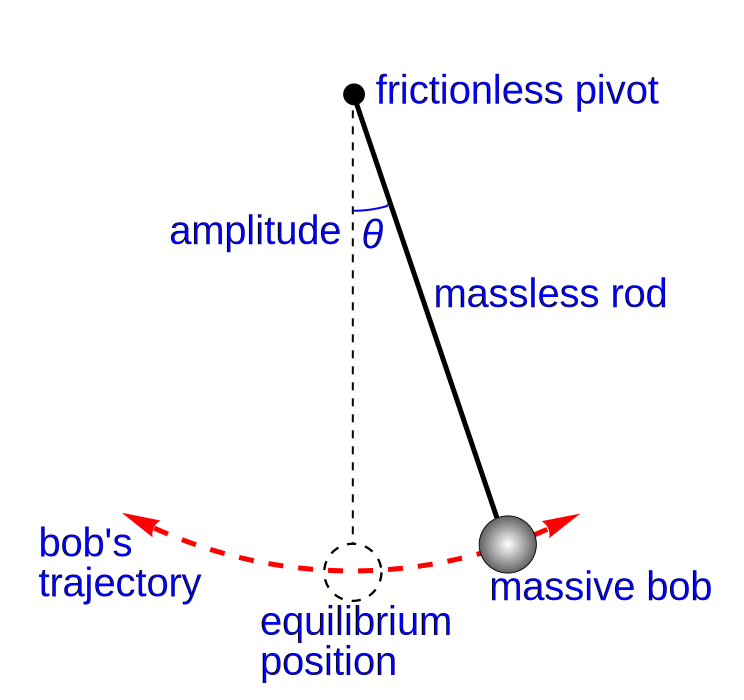

## Introduction



A pendulum

## Experiment design

## Hypotheses

Null hypothesis: Changes in the string's length do not affect the time period.

Alternate hypothesis: Changes in the string's length do affect the time period.

## Analysis

### Data overview
 
```{r}
data <- read.csv("data.csv")
data
summary(data)
```

Treating the length as discrete groups, let us estimate the mean and standard
deviation of each group.

```{r}
aggregate(time_10_periods ~ length_cm, data = data, function(x) c(mean = mean(x), sd = sd(x), n = length(x)))
```

This allows us to see that there is a significant Difference in Means betwen
groups, of approximately 0.6 between neighbouring groups, where the standard
deviation is roughly around 0.1 to 0.2.

In order to gain a general sense of the data we have obtained, let us plot the
data. A box plot is used, to present the information aggregated by group above.

```{r}
boxplot(time_10_periods ~ length_cm, data = data,
	main = "Effect of Length on Time",
	xlab = "Length (cm)",
	ylab = "Time (10 periods)")
```

### Linear regression

```{r}
model <- lm(time_10_periods ~ length_cm, data = data)
summary(model)
```

We shall run various diagnostic plots of this linear regression model to
confirm whether it is truly a linear regression:

```{r}
plot(model)
```

There are insufficient sample points for the diagnostic plots to be accurate,
but they seem to be acceptable for this sample size. It is however somewhat
unclear what causes the enlarged residues for large theoretical quantities.


Given that a linear regression is mostly appropriate as suggested by the
diagnostic tests, its $p$-value $4.52 \times 10^{-12}$ suggests that it is
extremely unlikely to obtain our result (or more extreme results) given that
the null hypothesis is true, therefore suggesting with high confidence that the 
null hypothesis is false and that the alternate hypothesis is true.
Therefore: changes in the string's length do affect the time period.

## T-tests


<!--
```{r}
pairwise.t.test(data$time_10_periods, data$length_cm, p.adjust.method = "bonferroni")
```
-->

## Informal bibliography

I'm not really sure how to get BibLaTeX working with R Markdown yet, so here's
just an itemized list of references without any particular bibliography format.

* Simple Gravity pendulum, by Chetvorno, public domain, https://commons.wikimedia.org/w/index.php?curid=5276335
